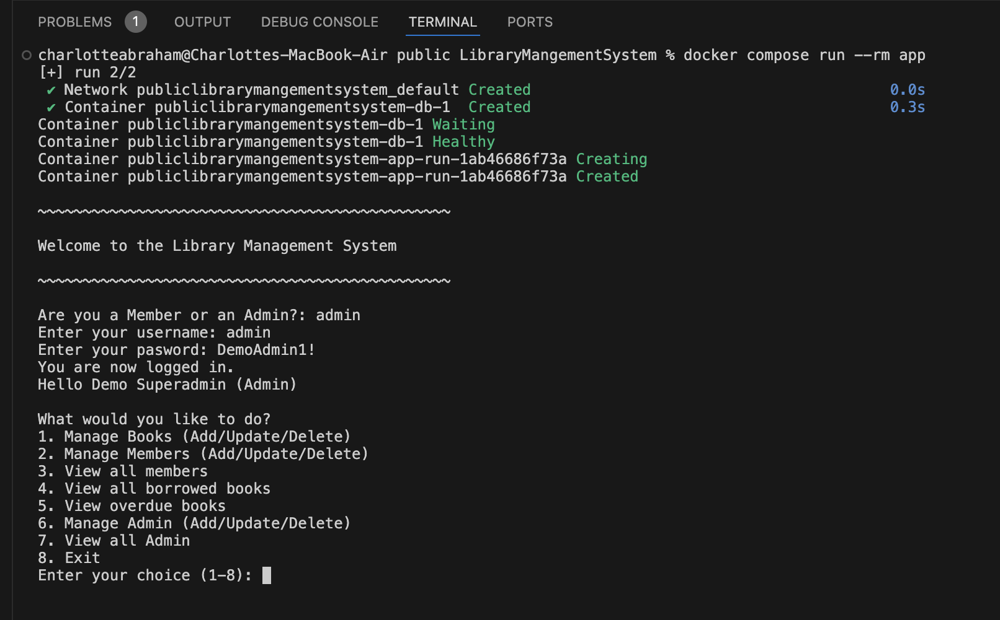
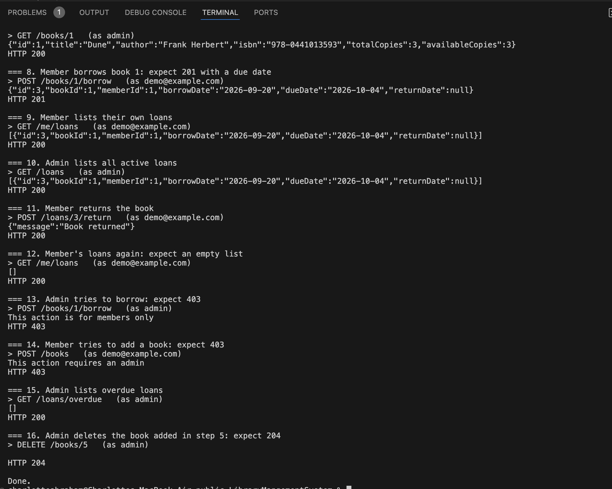
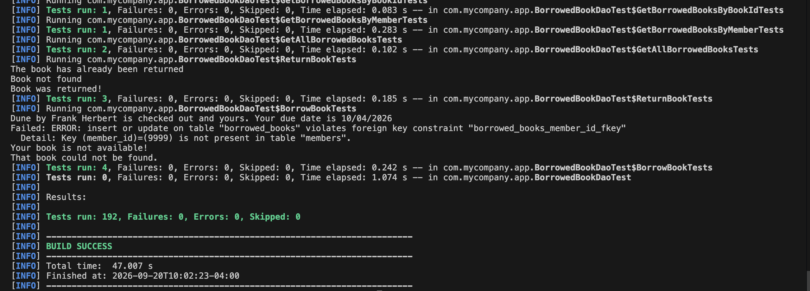

# Library Management System


A library management system written in Java and backed by PostgreSQL. The main interface is an interactive console app for members and admins. A REST API for books and loans sits on top of the same tested data-access layer.
 
Highlights:
 
- **58 integration tests that run the real SQL against a real PostgreSQL**, started on demand with Testcontainers, plus mocked unit tests for the rest of the code.
- **GitHub Actions CI** that runs the whole suite on every push.
- **One-command Docker setup** that starts the database, creates the tables, and seeds demo data.
- **REST API** with role-based access, described in an OpenAPI file, with a demo script.



<br>
<br>

<br>
<br>

<br>
<br>
## Quick start (Docker)
 
You need [Docker Desktop](https://www.docker.com/products/docker-desktop/) running. From the project root:
 
**Console app**
 
```
docker compose run --rm app
```
 
**REST API**
 
```
docker compose up -d --build db api
bash demo.sh
```
 
demo.sh walks through the API from start to finish: logging in, searching, adding a book, borrowing and returning, and the requests that should be rejected. It prints every request and its status code.
 
**Demo logins** (Docker setup only)
 
| Role | Login | Password |
|---|---|---|
| Superadmin | admin | DemoAdmin1! |
| Member | demo@example.com | DemoMember1! |
 
**Stop everything**
 
```
docker compose down       # keeps the database data
docker compose down -v    # also wipes it; demo data reloads next time
```
 
## Console app
 
The console app is the full interface. Everything in the project can be done from it, including registering members and managing members and admins, which the REST API doesn't cover.
 
At the first prompt choose **Admin** or **Member**. Members can log in or register a new account. Accounts created by an admin start with a temporary password and must set their own on first login. Loans last 14 days, and passwords are stored as bcrypt hashes.
 
**Member menu**
 
```
What would you like to do?
1. Search books (by title/author)
2. Check out a book
3. Return a book
4. View my borrowed books
5. Change password
6. Exit
```
 
**Admin menu** (superadmins see options 6 and 7; regular admins see the first five options, then Exit)
 
```
What would you like to do?
1. Manage Books (Add/Update/Delete)
2. Manage Members (Add/Update/Delete)
3. View all members
4. View all borrowed books
5. View overdue books
6. Manage Admin (Add/Update/Delete)
7. View all Admin
8. Exit
```
 
## REST API
 
Every endpoint except `/health` needs HTTP Basic authentication. A login containing `@` is treated as a member's email, and anything else as an admin username.
 
| Method and path | Who | What it does |
|---|---|---|
| `GET /health` | anyone | Health check |
| `GET /books` | any login | List all books, or search with `?title=` or `?author=` |
| `GET /books/{id}` | any login | Get one book |
| `POST /books` | admin | Add a book |
| `PUT /books/{id}` | admin | Replace a book's details |
| `DELETE /books/{id}` | admin | Delete a book (blocked while it is checked out or has loan history) |
| `POST /books/{id}/borrow` | member | Borrow a book |
| `POST /loans/{id}/return` | member | Return one of their own loans |
| `GET /me/loans` | member | List their active loans |
| `GET /loans` | admin | List all active loans |
| `GET /loans/overdue` | admin | List overdue loans |
 
Responses use standard status codes: `401` for a missing or wrong login, `403` for a valid login that isn't allowed to do that (for example, an admin trying to borrow), `404` for a missing book or loan, and `409` for conflicts such as a duplicate ISBN or no copies available.
 
The full description is in [`docs/openapi.yaml`](docs/openapi.yaml). You can import it into Postman or any OpenAPI tool to get every endpoint as a ready-made request.
 
## Tests and CI
 
```
mvn test
```
 
To run them yourself you need Java 17, Maven, and Docker (the DAO tests start a PostgreSQL container). CI runs them for you on every push.
 
**Unit tests** cover the session, authentication, validation, and password classes. The DAO layer is mocked with Mockito, so they run without a database.
 
**DAO integration tests** cover MemberDao, AdminDao, BookDao, and BorrowedBookDao (58 tests). Instead of mocking JDBC, they run the real SQL against a PostgreSQL 16 container started by Testcontainers. One container is shared across all test classes, and every table is emptied before each test. 
 
## Project structure
 
```
src/main/java/com/mycompany/app/
  App.java                       console app entry point
  ApiApp.java                    REST API entry point (Javalin)
  MemberSession, AdminSession    menus and actions for each role
  AuthHelper, InputValidator,
  PasswordUtil                   login, input checks, password helpers
  *Dao.java                      data-access classes (the SQL lives here)
  Admin, Member, Book,
  BorrowedBook, DaoResult        model classes and result type
  DBConnection.java              opens database connections
 
src/test/java/com/mycompany/app/
  AbstractDaoTest                shared PostgreSQL test container
  *DaoTest                       integration tests against a real database
  *SessionTest, AuthHelperTest,
  InputValidatorTest,
  PasswordUtilTest               unit tests (DAOs mocked)
 
docs/openapi.yaml                API description
demo.sh                          API walkthrough script
Dockerfile, docker-compose.yml   container setup
docker/initdb/                   demo admin, member, and books
.github/workflows/ci.yml         CI pipeline
```
 
## How the Docker setup works
 
- The **Dockerfile** is a multi-stage build. The first stage compiles the project with Maven, and the second copies the JAR onto a slim Linux (Eclipse Temurin JRE) image. The app runs as a non-root user.
- **docker-compose.yml** starts PostgreSQL, the console app, and the API. The app and the API wait for the database's health check before starting, and get their connection details from environment variables.
- **Schema and seed data** load automatically the first time the database volume is created, through PostgreSQL's init-script folder.
- **.dockerignore** keeps local credentials (db.properties) and build output out of the image.
- **Configuration** comes from the first place that has a value: a Java system property (the tests use this), then an environment variable (DB_URL, DB_USER, DB_PASSWORD, which Docker uses), then a local db.properties file (gitignored). The API listens on 127.0.0.1:8080 by default. Docker sets API_HOST=0.0.0.0 inside the container and publishes the port to your machine only.

